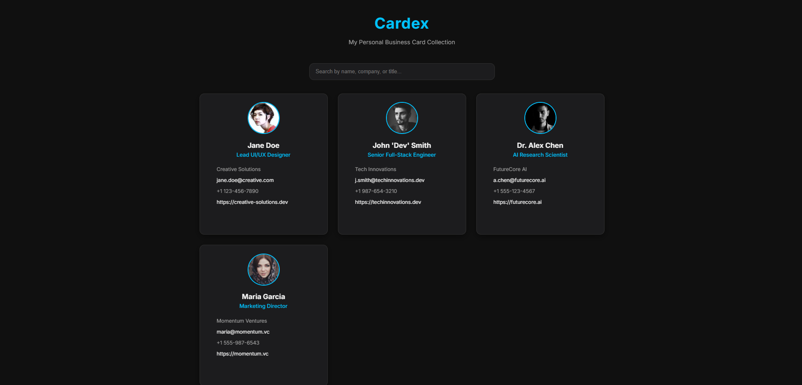

# 🪪 Cardex — Personal Business Card Repository

A sleek, responsive, and **searchable digital collection** of business cards. Built with **HTML, CSS, and vanilla JavaScript**, Cardex lets you organize, view, and privately annotate cards — hosted effortlessly on **GitHub Pages**.

---
## 🚀 Live Demo

[](https://abishek-2425.github.io/card-repo/)




---

## ✨ Key Features

* **Modern Dark UI** — Smooth, minimal interface with dark aesthetics.
* **Instant Search** — Filter by name, company, or title as you type.
* **Responsive Grid Layout** — Looks clean on mobile, tablet, or desktop.
* **Private Notes & Metadata** — Sensitive fields (`note`, `met_at`) are visible *only* via a secret access key.
* **Hidden Access Logic** — Use a private `?key=your-secret` URL parameter to unlock admin-only details.
* **Static & Lightweight** — Loads instantly, no backend or database.
* **Easy Management** — Edit one JSON file (`cards.json`) to update the entire site.
* **Free Hosting** — Deployed via GitHub Pages.

---

## ⚙️ File Overview

**📁 Project Structure**

```
d:/PROJECTS/card-repo/
├── app.js          # Handles data fetching, search, and rendering logic
├── cards.json      # Data file containing all card info
├── index.html      # Webpage structure and secret access logic
├── style.css       # Responsive dark theme and grid design
└── README.md       # Documentation (this file)
```

---

## 🧩 Data Format — `cards.json`

Your data file contains one root object with a `"cards"` array. Each element represents a business card in the format below:

```json
{
  "cards": [
    {
      "full_name": "Jane Doe",
      "job_title": "Lead UI/UX Designer",
      "company_name": "Creative Solutions",
      "phone_number": "+1 123-456-7890",
      "email": "jane.doe@creative.com",
      "website": "https://creative-solutions.dev",
      "image_url": "https://i.pravatar.cc/150?img=25",
      "socials": {
        "linkedin": "https://linkedin.com/in/janedoe",
        "dribbble": "https://dribbble.com/janedoe"
      },
      "met_at": "DesignCon 2025, San Francisco",
      "note": "Jane shared insightful ideas about user flow optimization and accessibility design systems."
    }
  ]
}
```

### 🧠 Field Descriptions

| Field          | Type   | Description                                    |
| -------------- | ------ | ---------------------------------------------- |
| `full_name`    | String | Person’s full name                             |
| `job_title`    | String | Designation or role                            |
| `company_name` | String | Organization or startup                        |
| `phone_number` | String | Contact number                                 |
| `email`        | String | Email address                                  |
| `website`      | String | Personal or company website                    |
| `image_url`    | String | Profile or logo image link                     |
| `socials`      | Object | Links for LinkedIn, GitHub, Twitter, Dribbble  |
| `met_at`       | String | (Private) Event or place where you met them    |
| `note`         | String | (Private) Your personal note about this person |

---

### 🔒 Hidden Fields (Protected by Secret Key)

* `note`
* `met_at`

These are only displayed if you open the site using your private access URL with the secret key parameter, for example:

```
https://abishek-2425.github.io/card-repo/?key=cardex-secret
```

If the key matches the one defined in `index.html`, these fields will appear. Otherwise, they remain hidden.

---


## 🔐 Secret Access Explained

This project includes a **private key-based visibility system** for sensitive data (like notes or meeting links).

1. In `index.html`, find this section:

   ```js
   const SECRET_KEY = "cardex-secret";
   ```
2. Change `"cardex-secret"` to your own private key (any string you like).
3. Only people with the correct key in their URL (e.g. `?key=your-key`) will see hidden fields.

---

## 🛠️ Built With

* **HTML5** — Semantic structure
* **CSS3** — Grid/Flexbox-based responsive layout
* **JavaScript (ES6+)** — Dynamic data fetching, search, and conditional rendering
* **Font Awesome** — Clean, minimal icons
* **Google Fonts (Inter)** — Simple, professional typography

---

## 🗂️ Managing Your Collection

Your "admin panel" is simply the `cards.json` file — edit it directly to add, update, or delete cards.

### ➕ Add a New Card

1. Open `cards.json`.
2. Copy an existing card object (`{ ... }`).
3. Add a comma `,` after the previous entry.
4. Paste the new one and edit its values.
5. Save the file.

### ✏️ Edit or 🗑️ Delete a Card

* **Edit:** Change any field directly in `cards.json`.
* **Delete:** Remove the entire `{ ... }` block of that card.
* Make sure your JSON syntax remains valid (no trailing commas).

### 🚀 Deploy Changes

After saving your edits, push them to GitHub:

```bash
git add cards.json
git commit -m "Updated business cards"
git push
```

Your GitHub Pages site will automatically update with the latest data.

---

## 💡 Future Enhancements

* Add card grouping or tags by company.
* Include local image caching or lazy loading.
* Implement a CSV/JSON import-export UI.
* Password protection using GitHub Pages actions.

---

## 🧠 Credits
>Inspired by the need for a simple, offline-friendly card repository that stays elegant and fast.

> Built and maintained by **Abishek-2425**.
